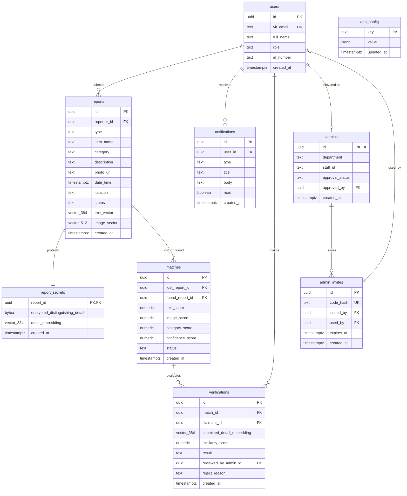

# Database Schema & Security Architecture
## VIT Lost & Found Platform

**Database**: PostgreSQL 15+ with `pgvector` and `pgcrypto` extensions.  
**Platform**: Supabase Managed Postgres.  
**Specification**: Compliant with Pre-Deployment Addendum v1.

---

## 1. Schema Diagram & Relationships

---

## 2. Table Definitions & Security Posture

### 2.1 `users`
- **Purpose**: Canonical identity for students, faculty, and staff.
- **RLS**:
  - `SELECT`: Authenticated users can view basic public fields (`full_name`, `role`).
  - `INSERT`: Self-registration during OTP verification matching `auth.uid() = id`.
  - `UPDATE`: Users can update their name/id_number. Updates to `role` are blocked by trigger `trg_guard_user_role`.

### 2.2 `app_config`
- **Purpose**: System-wide configuration parameters (allowed domains, threshold numbers, bootstrap status).
- **Core Keys**:
  - `allowed_email_domains`: Array of institutional domains confirmed by the institution.
  - `bootstrap_completed`: Boolean flag (`true`/`false`) preventing repeated admin bootstrap calls.
  - `admin_bootstrap_key_hash`: Cryptographic SHA-256 hash of the one-time admin setup key (cleared after first use).
  - `verification_thresholds`: `{ "auto_approve": 0.80, "escalate_to_admin": 0.50 }`.

### 2.3 `reports`
- **Purpose**: Lost and Found item records.
- **Indexes**:
  - IVFFlat cosine similarity indexes on `text_vector` and `image_vector`.
- **RLS**:
  - `SELECT`: Public to all authenticated users.
  - `INSERT`: Authenticated users (`reporter_id = auth.uid()`).
  - `UPDATE`: Owner or approved admin.

### 2.4 `report_secrets`
- **Purpose**: High-security storage for private identifying marks.
- **Security Rule**: **Strictly zero client-readable RLS policies**.
- **Access**: Only accessible via `SECURITY DEFINER` functions running server-side (`submit_distinguishing_detail`, `submit_verification`).

### 2.5 `storage.buckets` (`item-photos`)
- **Access Model**: **Private Bucket** (`public = false`). Item photos are potentially identifying and must not be exposed to the public internet without authorization.
- **Access Method**: Accessed exclusively via short-lived signed URLs generated server-side.
- **Path Convention**: `item-photos/{report_id}/{filename}`
- **Storage RLS Policies**:
  - `INSERT`: User can only insert if `report_id` belongs to them (`reports.reporter_id = auth.uid()`).
  - `SELECT`: User can read if they own the report, are a party to an active AI match involving the report, or are an approved admin.
  - `UPDATE` / `DELETE`: User owns the report or is an approved admin.
- **File Constraints**: Max 5MB, `image/jpeg`, `image/png`, `image/webp`.

---

## 3. Security Definer Functions Reference

1. `is_admin(uid UUID) -> BOOLEAN`:
   Returns true if `uid` exists in `admins` with `approval_status = 'approved'`. Uses `SECURITY DEFINER` to avoid circular RLS evaluation.
2. `bootstrap_first_admin(setup_key TEXT, target_user_id UUID, department TEXT, staff_id TEXT) -> JSONB`:
   Checks `bootstrap_completed = false`, validates setup key hash against `app_config`, elevates target user to approved admin, and sets `bootstrap_completed = true`.
3. `redeem_admin_invite(code TEXT, department TEXT, staff_id TEXT) -> JSONB`:
   Validates invite hash and expiry, sets `used_by`, creates `admins` record in `pending` status.
4. `admin_approve_user(target_user_id UUID) -> VOID`:
   Verifies caller is approved admin, then transitions target to `approved`.
5. `submit_distinguishing_detail(report_id UUID, detail_text TEXT, embedding vector(384)) -> VOID`:
   Encrypts `detail_text` using `pgp_sym_encrypt` and inserts into `report_secrets`.
6. `submit_verification(match_id UUID, submitted_embedding vector(384)) -> JSONB`:
   Extracts secret embedding, calculates cosine similarity server-side, applies thresholds, and creates verification record.
